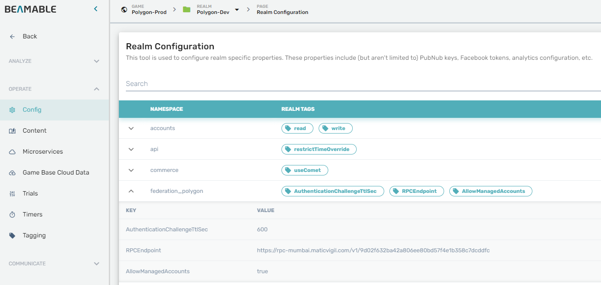

# Beamable Polygon

Install link.
https://github.com/beamable/polygon-example.git?path=/Packages/com.beamable.polygon#0.0.0

## Configuration
Configuration defaults are hard-coded inside **Runtime/PolygonFederation/Configuration.cs**  
You can override the values using the realm configuration.  

**Default values:**

| **Namespace**      | **Key**                       | **Default value**                                                             | **Description**                                                               |
|--------------------|-------------------------------|-------------------------------------------------------------------------------|-------------------------------------------------------------------------------|
| federation_polygon | RPCEndpoint                   | https://rpc-mumbai.maticvigil.com/v1/9d02f632ba42a806ee80bd57f4e1b358c7dcddfc | Cluster RPC API URI                                                           |
| federation_polygon | AllowManagedAccounts          | true                                                                          | Allow custodial wallets for players                                           |
| federation_polygon | AuthenticationChallengeTtlSec | 600                                                                           | Authentication challenge TTL |

**IMPORTANT:** Configuration is loaded when the service starts. Any configuration change requires a service restart.