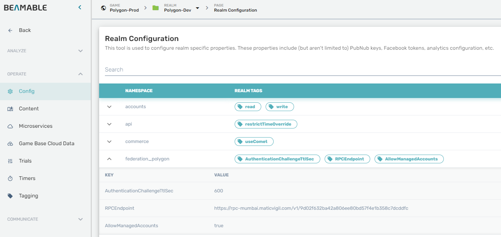

# Beamable Polygon Sample

Welcome to the Beamable Polygon Sample project! This is a Unity project that demonstrates how
to integrate the [Polygon](https://polygon.technology/) blockchain into a [Beamable](https://beamable.com/)
powered game.

## Getting Started

Before getting started, please head to [Beamable](https://beamable.com/) and sign up.
You should have the following tools installed on your development machine.

1. [Unity 2021](https://unity.com/download)
2. [Docker](https://www.docker.com/products/docker-desktop/)
3. [Net6](https://dotnet.microsoft.com/en-us/download/dotnet/6.0)
4. [Git](https://git-scm.com/downloads)

Please sing up for a private Polygon RPC API [Matic Vigil](https://rpc.maticvigil.com/) for
your development environment. This project defaults to the [Mumbai Testnet](https://mumbai.polygonscan.com/) and uses a shared RPC endpoint
which my be rate limited.

## ERC1155
ERC1155 is a hybrid token standard supporting both fungible and non-fungible tokens. It allows for the creation
of a single smart contract that can support multiple tokens, making it more cost-efficient than creating separate
contracts for each token. This is particularly useful in gaming, where a game may have a large number of 
unique items or characters that need to be represented as tokens. Additionally, ERC1155 supports batch 
transactions, which means that multiple tokens can be transferred in a single transaction, reducing gas costs 
and improving the overall user experience. Our integration uses a single ERC1155 smart contract to represent 
all game tokens, making it more efficient and cost-effective for both developers and users.  
Source: [DefaultERC1155.sol](https://github.com/beamable/polygon-example/blob/main/Packages/com.beamable.polygon/Runtime/PolygonFederation/Solidity/Contracts/DefaultERC1155.sol)  

## Solidity
We are using the **solc** Solidity compiler wrapped inside of the integration microservice to compile the smart contract
at runtime. You can clone this repository and modify the smart contract per your requirements. We tried to create a contract
that is generic as possible for most use-cases.

## Sample Project
To get started with this sample project, use `git` to clone this project, and open it
with Unity 2021.

## Importing Into Your Project
The Polygon integration is portable to other Beamable Unity projects. The Microservice and
Microstorage code can be imported into a target project. The best way is to use Unity Package Manager
and add a part of this repository as an external package.

**Before doing this, please ensure that the target project already has Beamable installed**

In the Unity Package Manager, [add a package via git-link](https://docs.unity3d.com/Manual/upm-ui-giturl.html).
for `com.beamable.polygon` and use the following git-link.
```shell
https://github.com/beamable/polygon-example.git?path=/Packages/com.beamable.polygon#0.0.1
```

Note: the end of the link includes the version number. You view the available versions by looking
at this repositories git tags.

## Federated content
This sample project includes one Polygon federated item - BeamSword, and one Polygon federated currency - BeamCoin.
You can enable federation on any item or currency.

## Try it out
1. Sign up for a custom Mumbai Testnet RPC URI at https://rpc.maticvigil.com/
2. Set your RPC URI as a realm config value "RPCEndpoint" (see Configuration)
3. Publish the **PolygonFederation** microservice along with the **PolygonStorage** microstorage.
4. Open the Portal an wait for the microservice to get into the **running** state.
5. Explore the microservice logs and microstorage data. Microservice should create and store your developer wallet on first run.
6. Use a [Polygon Faucet App](https://faucet.polygon.technology/) to request some test MATIC tokens for your developer wallet.
7. Start the SampleScene from this repo. It will create a Beamable player account on your realm.
8. Click "Attach Identity" - this should create a wallet for the player and associate it with the players account.
9. Press the tilde key to enter the "Admin console" and type the `portal` command. This will open the player overview page in the Beamable Portal.
10. Use the Inventory feature to grant some federated items to the player. Granting items will mint new NFTs, and granting currency will transfer fungible tokens to the players wallet.

NOTE: First request to the microservice will initiate the compile and deploy procedure for the smart contract. Depending on your RPC endpoint, it may result in a timeout. Be sure to check the microservice logs.

## NFT metadata
We're using our existing Content System backed by AWS S3 and AWS CloudFront CDN for storing NFT metadata. Every property you specify in the Inventory `CreateItemRequest` will become a NFT metadata property.
To specify a root level metadata property, like "image" or "description", you just prefix the property name with a '$' character.  
Example `CreateItemRequest`:
```json
{
  "contentId": "items.sword",
  "properties": [
    {
      "name": "$image",
      "value": "someimage"
    },
    {
      "name": "$description",
      "value": "strong sword"
    },
    {
      "name": "damage",
      "value": "500"
    },
    {
      "name": "price",
      "value": "350"
    }
  ]
}
```
Resulting metadata file:
```json
{
  "image": "someimage",
  "description": "strong sword",
  "properties": [
    {
      "name": "damage",
      "value": "500"
    },
    {
      "name": "price",
      "value": "350"
    }
  ]
}
```

## Configuration
Configuration defaults are hard-coded inside **Runtime/PolygonFederation/Configuration.cs**  
You can override the values using the realm configuration.  


**Default values:**

| **Namespace**      | **Key**                       | **Default value**                                                             | **Description**                                                               |
|--------------------|-------------------------------|-------------------------------------------------------------------------------|-------------------------------------------------------------------------------|
| federation_polygon | RPCEndpoint                   | https://rpc-mumbai.maticvigil.com/v1/9d02f632ba42a806ee80bd57f4e1b358c7dcddfc | Cluster RPC API URI                                                           |
| federation_polygon | AllowManagedAccounts          | true                                                                          | Allow custodial wallets for players                                           |
| federation_polygon | AuthenticationChallengeTtlSec | 600                                                                           | Authentication challenge TTL |

**IMPORTANT:** Configuration is loaded when the service starts. Any configuration change requires a service restart.